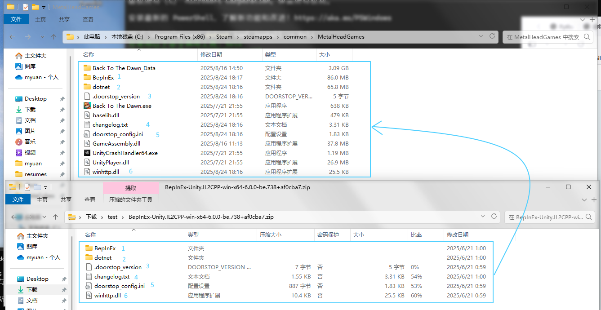
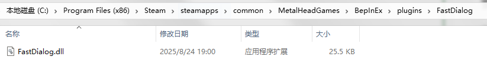

# FastDialog

用于快速跳过常规对话. 

动物迷城中的对话框分为三种, 一种是固定事件带来的对话, 包含剧情发展, 这种可以在二周目开始长按某键跳过, 但私人关系对话和见到某些物件思考无法跳过, 多刷时点对话实在很无聊. 

## 使用

- F9 开始监听对话并自动跳过, F10结束监听
- F8 兼容一下手柄模式

> 原理: 检测到可跳过的对话框就模拟鼠标点一下, F8调用游戏开发者的内部接口, 在手柄模式下启用键鼠兼容模式

## 安装

本插件基于 BepInEx 6.0 开发, 要正确安装插件需要两步:

1. 安装 BepInEx 6.0
2. 安装本插件 dll

### 下载

1. 如果你能访问 xget (通常可以), 可以点击 https://xget.xi-xu.me/gh/myuanz/BackToDawnCommPlugin/releases/download/1.0.1/FastDialog-1.0.1.zip 和 https://xget.xi-xu.me/gh/myuanz/BackToDawnCommPlugin/releases/download/1.0.1/BepInEx-Unity.IL2CPP-win-x64-6.0.0-be.738+af0cba7.zip 
2. 如果你的 Github 足够快, 可以从 https://github.com/myuanz/BackToDawnCommPlugin/releases 下载
3. 如果你有百度盘会员, 可以从 https://pan.baidu.com/s/1RykwajmrnOtyts2o0N2jYw?pwd=pyht 下载

下载完成后你应该得到这两个文件 

### 首次安装

1. 在 Steam 库中找到动物迷城, 右键->管理->浏览本地文件
2. 将 BepInEx 解压到游戏根目录, 解压后应当大致如下 
3. 正常启动一次游戏, BepInEx会解码游戏, 此时应该有一个命令行黑框出现, 稍等片刻游戏正常启动后就可关掉
2. 进入`BepInEx\plugins`下, 将 `FastDialog.zip` 里的 dll 解压到这里,  你的游戏可能在别处安装, 但路径的最后三级应该都是`BepInEx\plugins\FastDialog`
5. 启动游戏
   
### 更新插件

1. 在 Steam 库中找到动物迷城, 右键->管理->浏览本地文件
2. 进入`BepInEx\plugins`下, 将 `FastDialog.zip` 里的 dll 解压到这里,  你的游戏可能在别处安装, 但路径的最后三级应该都是`BepInEx\plugins\FastDialog`
3. 启动游戏

## TODO

- [ ] 记录对话并在游戏内展示


## 从源代码开发

```powershell
$env:BTTD_DIR = "你的游戏安装目录"
dotnet build
python build_and_copy.py # 用于结束游戏、构建dll、复制dll、启动游戏
```